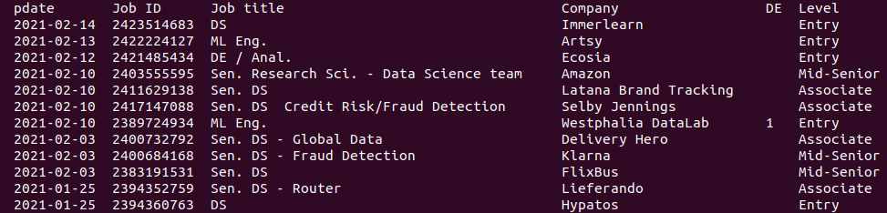

# `lilo_scraper`


Retrieve info from locally-saved webpages from LinkedIn. 

This avoids having to scrape directly from their (or any other) website. 


## Description


A web-scraper built on BeautifulSoup to extract information from downloaded LinkedIn job adverts, with URLs like   
`https://www.linkedin.com/jobs/view/1234567890/`,   
and aggregate it all into a CSV file.

The collected information is:

- Intrinsic Data (from LinkedIn)
    - Job ID
    - Job title
    - Company Location
    - Company Name
    - Seniority Level
    - Industry
    - Employment Type
    - Job Functions
    - Number of applicants
 
 - Derived data
    - DE (identifies whether the job ad is in German)
    - Status (based on how webpages are locally stored, determines which jobs are closed, applied for, etc.)
    - Posted Date (a duration fro when the job was first posted)
    - Data of webpage download (used to adjust the Posted Date)

## Usage

Basic usage is to first collect a series of html files into a given directory, then the scraper does the rest.

```bash
    python lilo_scraping.py -d <./path/saved_webpages_dir> -m <./path/master.csv> -v
```
This generates a CVS which can be read in any way you like. However, I find it useful to quickly see everything in the terminal, so I created some additional utilities: 

   - `jshow` generates a smaller CSV to be (re)read directly from the command line using `column`
    
    
   - it thins down the information and also uses abbreviations to cut down on space.
   - There are a number of functions to access and manipulate htmls based on there Job ID number
        - jread` takes a Job ID and then prints out that specific entry with the full details of the job advertisement. 
        - `jfilt` this is a special filter which shows when the "DE" column has a "1" in it
        - `jmove` moves htmls to a specified location
        - `jfind` gets the location of the html with the Job ID
        - `jgrep`, is an alias for `jshow | grep <JobID>`
        - **Note** the Job ID is always given in the column of the table printed from `jshow`

## Known Issues

Sometimes the tags change and the information is not found
    
    
**Note**  
This project has been set up using PyScaffold 3.2.3. For details and usage
information on PyScaffold see https://pyscaffold.org/.
